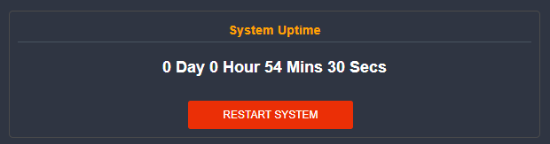

# 1970 VENDO TIME FIX

## 1.) Add your vendo to the address list

Read more on 
**[Using Address List for Vendos](./../Address-List-Vendo/README.md)**

>   **Do this for all of your vendo**
> - Name: JuanfiVendo
> - Address: < vendo ip address >

<p align="center">
  
</p>

## 2.) Adding the NTP server firewall rule

### a.) Paste the script in the terminal
```bash
/ip firewall nat add action=dst-nat chain=dstnat dst-port=123 protocol=udp src-address-list=JuanfiVendo to-addresses=216.239.35.12 to-ports=123
```

### b.) Manually input the firewall rule

> - Action: **dst-nat**
> - Protocol: **17 (udp)**
> - Dst Post: **123**
> - Src-address-list: **JuanfiVendo**
> - Action: **dst-nat**
> - To-addresses: **216.239.35.12**
> - To-port: **123**

<p align="center">
  
</p>

## 3.) Restart your vendo

<p align="center">
  
</p>


## 3.) Done!

<p align="center">
  
</p>

---

Credits to this post: [Juanfi Group Post](https://www.facebook.com/groups/1172413279934139/posts/1641047469737382/)
