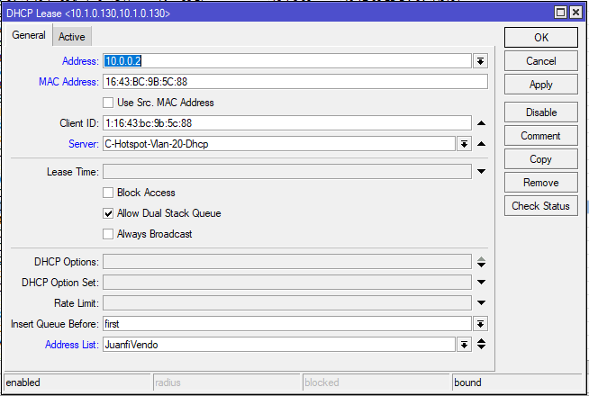
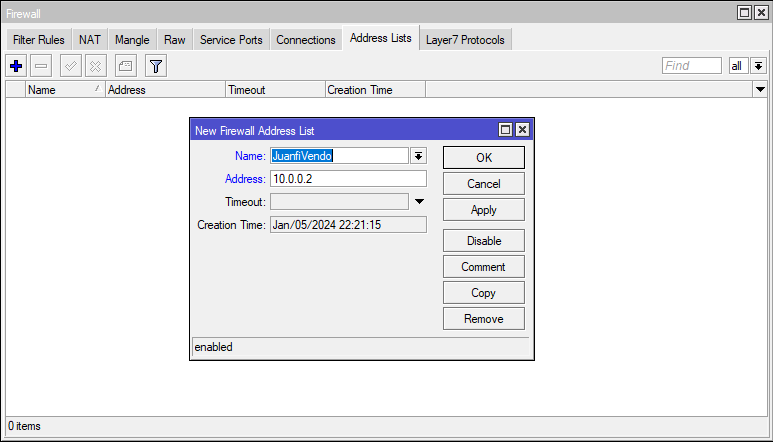

# USING ADDRESS LIST FOR VENDO

## 1.) Adding the vendo to the address list

### a.) Dynamically add the ip address

>   **Do this for all of your vendo**
> - Address: **< vendo ip address >**
> - Address List: **JuanfiVendo**

<p align="center">
  
</p>


### b.) Manually add the ip address

>   **Do this for all of your vendo**
> - Name: **JuanfiVendo**
> - Address: **< vendo ip address >**
> 
<p align="center">
  
</p>

## 2.) Paste this script in the Terminal

### Walled Garden IP
```bash
/ip hotspot walled-garden ip add action=accept disabled=no dst-address-list=JuanfiVendo
```
### Firewall Filter
```bash
/ip firewall filter add action=accept chain=input place-before=0 comment=JuanfiVendo src-address-list=JuanfiVendo
```

## 3.) Done!

<p align="center">
  
</p>
