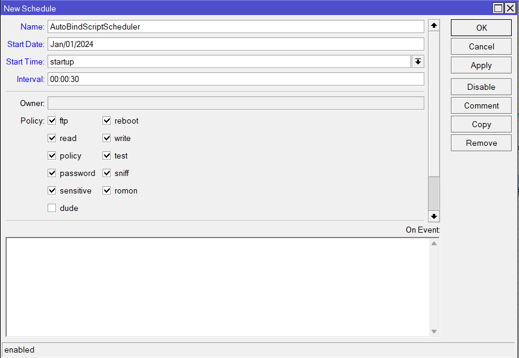

# AUTO BIND VENDO SCRIPT 
---
## How It Works:

1. **Scheduler Interval Setup**:
    - The system has a scheduler configured to run at specific intervals.

2. **Scan for DHCP Servers**:
    - At each interval, the scheduler scans the DHCP servers.
    - It specifically looks for DHCP servers that do not have static addresses assigned.

3. **Add Bind Script**:
    - When a DHCP server without a static address is found, the system adds a bind script to that server.
    - This bind script is designed to manage IP assignments for connected devices.

4. **NodeMCU Connection**:
    - When a NodeMCU device connects to the DHCP server, the bind script is triggered.
    - The bind script assigns a proper static IP address to the NodeMCU.
    - It also adds the NodeMCU to the IP binding.

5. **Restart NodeMCU**:
    - After the bind script runs and assigns the static IP, it is necessary to restart the NodeMCU.
    - Restarting the NodeMCU ensures it updates its active address to the newly assigned static IP.

---

## Changing the NodeMCU

- **Remove the Static Device**:
    - If you want to change the NodeMCU, first remove the static device from the DHCP lease.
    - Wait for the scheduler to detect this change and apply the bind script to the DHCP server.

- **Connect the New NodeMCU**:
    - Connect the new NodeMCU to the DHCP server.
    - The script will assign a new static IP to the new NodeMCU.
    - A restart is still required to update its active address.

---
## **Notes**
-  The scheduler will exclude any DHCP server with static addresses already set. Ensure there are no static addresses in the lease for the script to work properly.
-  The vendo host number is determined by ``:local vHost "2";``. By Default it is ``IP: x.x.x.2`` You can change it in the scheduler line 3.
-  The excludedServers only work for a single dhcp server, if you want to exclude 2 or more dhcp server, Just place a space `` `` in the lease script.
---

# AUTO BIND VENDO SCRIPT 

## 1.) Create a new scheduler

> - Name: **any**
> - Start Date: **Jan/01/2024**
> - Start Time: **startup**
> - Interval: **00:00:30**

<p align="center">
  
</p>

## 2.) Paste the following script in the on event.

```bash
  :local excludedServers {"LAN"};
  :local script "\
      :local vHost \"2\";\r\
      \n\r\
      \n:local hN \$\"lease-hostname\";\r\
      \n:local hM \$\"leaseActMAC\";\r\
      \n:local hA \$\"leaseActIP\";\r\
      \n:local sN \$\"leaseServerName\";\r\
      \n\r\
      \n:local lI [/ip dhcp-server lease find where host-name=\$hN];\r\
      \n\r\
      \n:if (\$leaseBound = \"1\" && [:find \$hN \"WIZnet\"] = 0) do={\r\
      \n    :log warning (\"Node Detected -> [ \" . \$hN . \" ]-[ \" . \$hM .  \" ]\");\r\
      \n\r\
      \n    :local nA ([pick \$hA  0 [find \$hA \".\" ([find \$hA \".\" ([find \$hA \".\"]+1)]+\
      1)  ]]. \".\". \$vHost);\r\
      \n\r\
      \n    :local eL [/ip dhcp-server lease find where address=\$nA dynamic=no];\r\
      \n    :local eB [/ip hotspot ip-binding find where address=\$nA];\r\
      \n\r\
      \n    :if ([:len \$eL] = 0) do={\r\
      \n        :log warning (\"Node Static -> [ \" . \$hA . \" ] to [ \" . \$nA . \" ]\");\r\
      \n        /ip dhcp-server lease make-static \$lI;\r\
      \n        /ip dhcp-server lease set \$lI address=\$nA mac-address=\$hM comment=\"==> VEND\
      O\";\r\
      \n        :log warning (\"Node Static -> Success\");\r\
      \n        /ip dhcp-server set [find name=\$sN] lease-script=\"\";\r\
      \n        :log warning (\"Node Script -> Auto bind script removed from \" . \$sN . \" ser\
      ver\");\r\
      \n    } else={\r\
      \n        :log error (\"Node Error -> Static \" . \$nA . \" ip address already exists. Pl\
      ease remove it from the lease first!\");\r\
      \n        :return;\r\
      \n    }\r\
      \n\r\
      \n    :if ([:len \$eB] = 0) do={\r\
      \n        :log warning (\"Node Binding -> [ \" . \$nA . \" ] [ \" . \$hM . \" ]\");\r\
      \n        /ip hotspot ip-binding add address=\$nA to-address=\$nA mac-address=\$hM commen\
      t=\"==> VENDO\";\r\
      \n        :log warning (\"Node Binding -> Success\");\r\
      \n    } else={\r\
      \n        /ip hotspot ip-binding set \$eB address=\$nA to-address=\$nA mac-address=\$hM c\
      omment=\"==> VENDO\";\r\
      \n        :log warning (\"Node Binding -> Updated\");\r\
      \n    }\r\
      \n}";


  :local dSrvs [/ip dhcp-server find];

  :foreach dSrv in=$dSrvs do={
      :local dN [/ip dhcp-server get $dSrv name];
      :if ([:find $excludedServers $dN] != 0) do={
          :local dS [/ip dhcp-server get $dSrv lease-script];
          :local dL [/ip dhcp-server lease find where server=$dN dynamic=no];

          :if ([:len $dL] = 0) do={
              :if ($dS = "") do={
                  /ip dhcp-server set $dSrv lease-script=$script;
                  :log info ("Node Autobind -> script added to " . $dN . " server");
              }
          }
      }
  }
```


## 3.) Done!

<p align="center">
  
</p>

---

