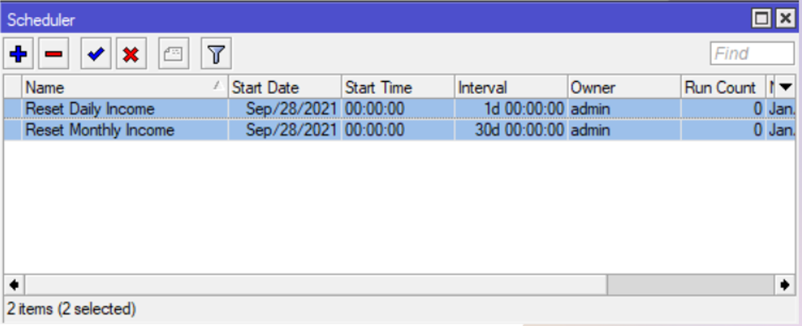
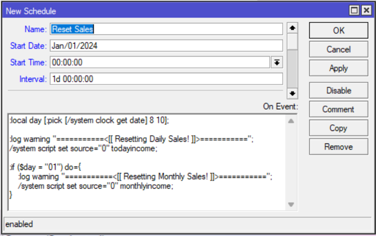

# ACCURATE SALES RESET FOR JUANFI SYSTEM

## 1.) Remove the old schedulers

> - Reset Daily Income
> - Reset Monthly Income

<p align="center">
  
</p>

## 2.) Creating a new scheduler

### a.) Pasting the script in the terminal
```bash
/system scheduler add interval=1d name="Reset Sales" on-event=":local day [:pick [/system clock get date] 8 10];:log warning \"===========<[[ Resetting Daily Sales! ]]>===========\";/system script set source=\"0\" todayincome;:if (\$day = \"01\") do={:log warning \"===========<[[ Resetting Monthly Sales! ]]>===========\";/system script set source=\"0\" monthlyincome;}" policy=ftp,reboot,read,write,policy,test,password,sniff,sensitive,romon start-date=jan/01/2024 start-time=00:00:00
```

### b.) Manually input the script

> - Name: **Reset Sales**
> - Start Date: **Jan/01/2024**
> - Start Time: **00:00:00**
> - Interval: **1d 00:00:00**

<p align="center">
  
</p>


## 3.) Done!


<p align="center">
  
</p>
