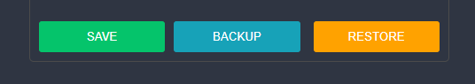
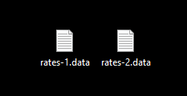
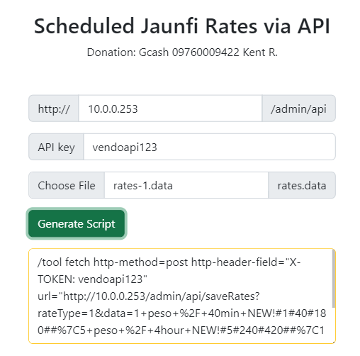
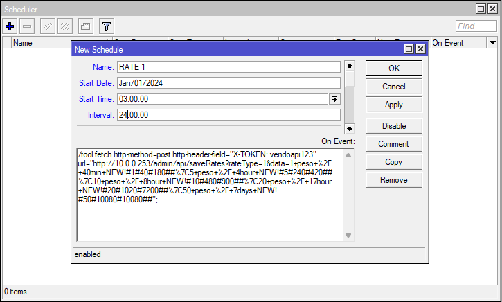
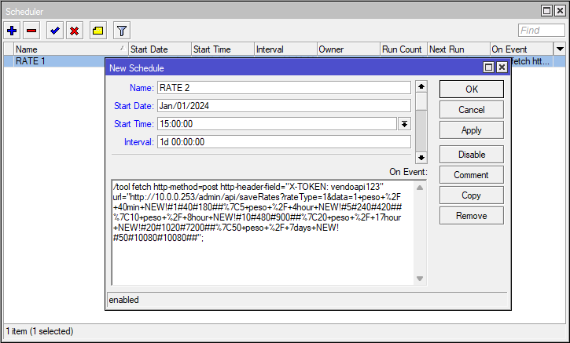

# SCHEDULED VENDO RATE

## 1.) Backup the 2 different rates you want to use

Go to the admin page of your vendo and backup the two different rates

  

  

## 2.) Go to our Juanfi Tools Github page and look for **[Scheduled Juanfi Rates via API](https://azk-networks.github.io/JuanFi-Tools/)**

Upload the file and generate the script for each rates

>   **Change this to fit your vendos setup**
> - Ip Address: **< vendo ip address >**
> - API Key: **< vendo api key >**

  

## 3.) Create a scheduler for each Rates

### a.) RATE 1

>   **Change the values for your needs**
> - Name: **RATE 1**
> - Start Date: **Jan/01/2024**
> - Start Time: **03:00:00** (3:00 AM)
> - Interval: **1d 00:00:00**

  

### b.) RATE 2
>   **Change the values for your needs**
> - Name: **RATE 2**
> - Start Date: **Jan/01/2024**
> - Start Time: **15:00:00** (3:00 PM)
> - Interval: **1d 00:00:00**

  

## 4.) Done!

  

